# Lógica de Programación: Primeros pasos

"CTRL + O" para abrir los archivos HTML, cuando sea necesario, y F12 o “CTRL + SHIFT + i” para abrir la ventana de 
herramientas del desarrollador (DevTools).

## Inicio

Su navegador es capaz de entender más de un lenguaje, por eso lo llamamos políglota.

Utilizan `Sublime text` para editar comenzaron con HTML básico. `<h1>` ` ` etc.

Mezcla en la primer clase Js dentro del HTML. Hizo un pop up sencillo: 

``

También se utilizó F12 para ver un error en Js 

Piensa que todo lo que está entre ``, está en el mundo JavaScript. Siendo así, el navegador 
interpretará ese trecho como JavaScript. Todo aquello que está escrito fuera de` `, es considerado
mundo HTML y será interpretado como HTML.

## Convenio de codificación

Es aconsejable siempre usar la codificación UTF8.

Con la instrucción `document.write(" texto ")` es útil para cosas dinámicas dentro del HTML que es estático. 
También mostró concatenación en Js

### Variables

Explicó variables en este caso para trabajar con fechas.

Utilizó `Math.round()`, También concatenó con otras variables string y num

### Lo que aprendimos

* A usar variables para reducir código.
* Secuencia de la ejecución de nuestro código.
* Diferentes tipos de datos en las variables y fórmulas.
* Buenas prácticas de programación: Nomenclatura de variables.

## Cree sus propias funcionalidades

### Funciones

Creó una función sencilla para hacer saltos de línea.

 

Juego crea otra función para ahorrar el `document.write()` mas bien a modo de ejemplo.

 

En la misma func. agrego el texto que nombro frase y se lo paso como parámetro cada vez que la uso y dentro llamo a 
otra function la de saltar líneas.

* todo dentro de los paréntesis pasa a ser "frase" el argumento

### actividad 

https://app.aluracursos.com/course/logica-de-programacion-primeros-pasos/task/72764

### Lo que aprendimos

* A crear funciones.
* Usar la consola de desarrollador para identificar errores y acompañar las variables.
* Buenas prácticas de programación: Nomenclatura de funciones.
* Funciones con parámetros.

### Normalmente, las funciones son creadas para retornar algo

Entonces la buena práctica aprendida es crear funciones objetivas que realicen en máximo una sola acción,
un solo cálculo y que nos retornen un valor y yo pueda reutilizar esa función en diferentes situaciones.

### Interactuando con el usuario

En este caso utilizo `f12` -- `console` -- el comando `prompt()`. para introducir valores por teclado y asi poder 
interactuar con el usuario.

La sintaxis completa y correcta es: `prompt(" pregunta ")` y eso lo asignamos a una variable.

Como en otros lenguajes, creé variables para almacenar las preguntas al usuario, y en este caso una variable más para
almacenar el retorno de la función. 

_Siempre va a devolver una string entonces si se multiplica lo usa como número si es suma lo concatena_

# Lógica de programación: Conceptos primordiales 2.º curso.

### Ejecute códigos diferentes dependiendo de la condición

**La función `prompt()` Siempre va a devolver una string entonces si se multiplica lo usa como número si es suma lo concatena**

Para solucionar esto usamos `parseInt`

### Trabajando con condiciones

En esta clase crea comparaciones con `if` las cuales devuelven un booleano y son utilizadas para comparar valores.

Lo explicó de forma secuencial y lógica de las 3 condiciones solo una podía cumplirse a la vez y fueron 3 `if` 
diferentes a modo de explicación.

### Mejorando el programa de IMC

Basado en la clase anterior y la tabla de la OMS se agrega el resultado para el usuario.

### Juego de adivinación de número

En esta clase utilizamos `Math.random()` para generar un valor aleatorio, a este número lo redondeo con `Math.round()`.
También se comenzó a usar el `else`.

https://www.w3schools.com/js/js_random.asp tiene bastantes reglas, siempre da un num entre 0 y menor a 1 por eso
lo multiplica por 10, y lo redondean porque es decimal.

Mejoré algo el código para el desafío sume que el usuario elija el valor n para sorteo y mejore las frases de 
resultado con más información

## Mientras que / Do y Do While

### Bucles

Se usó while como primer bucle.

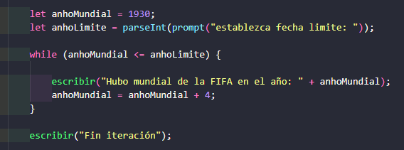

### Otra forma de Repetir   (FOR)

Van dos veces que me olvido en el bucle sumar al `contador = contador + 1` pongo solo contador mas 1 y me da error.
Cuando es más 1 puedo usar contador++ obviamente.

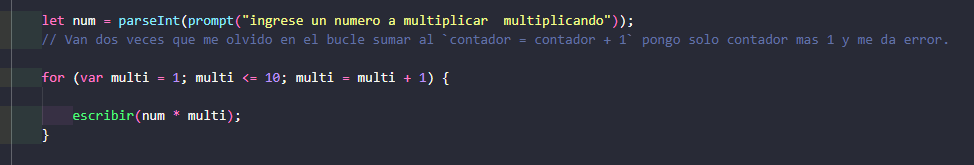

### Acumulando Variables

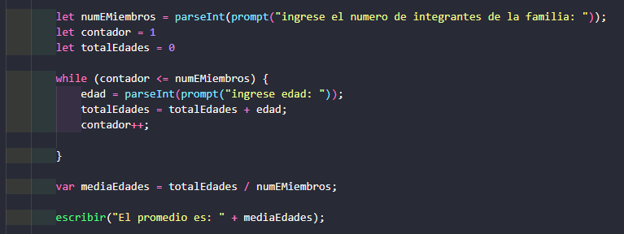

mediaEdades no me funcionó con `let` por eso usé `var`.

###  Interrumpiendo una Repetición
https://app.aluracursos.com/course/logica-de-programacion-conceptos-primordiales/task/73401

Voy a mejorar el juego de adivinación para que tenga 3 intentos, poniendo todo dentro de un while.
Para cortar la iteración utilizamos `break` en este caso en él `if`.

Utiliza mucho `VAR` en este caso si uso let se rompe el último if porque está fuera del while y cambia el scope.

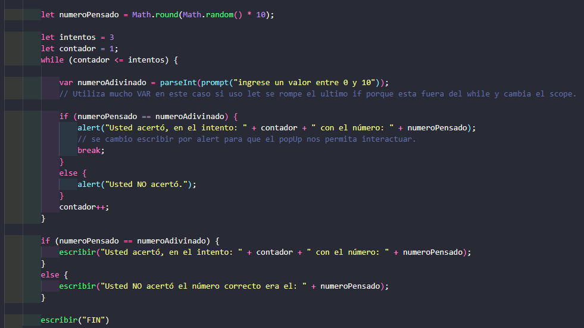

### Repeticiones Anidadas

En esta clase usa un for dentro de otro para dibujar líneas y columnas con `*`.

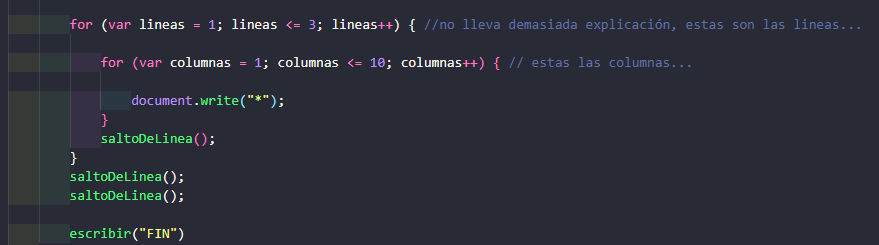

### Lo que aprendimos

* Repetir tareas y actividades con iteraciones while.
* Repetir tareas y actividades con iteraciones for. 
* Interrumpir iteraciones con break.
* Realizar iteraciones anidadas, un loop dentro de otro.

## Clase 3 comenzamos con jQuery

https://www.w3schools.com/js/js_jquery_selectors.asp

jQuery fue creada en 2006 por John Resig. Fue diseñada para manejar incompatibilidades del navegador y simplificar la
manipulación del DOM, eventos, animaciones y Ajax etc.

Es una de las librerías más populares de Js en el mundo.

### Campo de Texto y Botón
`Imput` y `button`

En esta clase haremos más interactiva la página, usando botones y campos de entrada con lógica y jQuery.

Continuando con este programa se mejora un poco la usabilidad haciendo que el campo input este focalizado al cargar  
la página y cada vez hagamos clic se <strong>"limpie"</strong> el campo y vuelva a tener focalizado input.  
Por último hacemos random al número para adivinar.

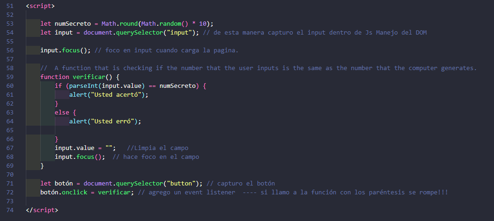

### Lo que aprendimos
* A mejorar la interacción del usuario con uso de botones.
* A mejorar la interacción del usuario con uso de cajas de texto.
* A mejorar la usabilidad de nuestro programa con `focus`.

## Clase 4
### Arrays

Los iteramos con `FOR`, el profesor lo explica simple, [ el for tiene 3 argumentos posición inicial, condición , sumador]

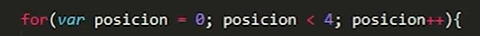

    1. creo el array  
    2. con el for recorro el array  
    3. el if dentro del for va a comparar los 4 valores del array con mi input  
    4. si es verdadero transforma la variable encontrado en verdadera // se explica en el segundo if.  
    5. con el break corto la ejecución con el primer acierto que tenga para que no vuelva a entrar al bucle. En una 
    lista muy grande ahorra tiempo.  
    6. en el segundo IF mientras sea falso muestra erró, cuando es true no muestra nada.  
     
    7. tengo una función, dentro un for dentro del for un if y otro if al mismo nivel del for.  

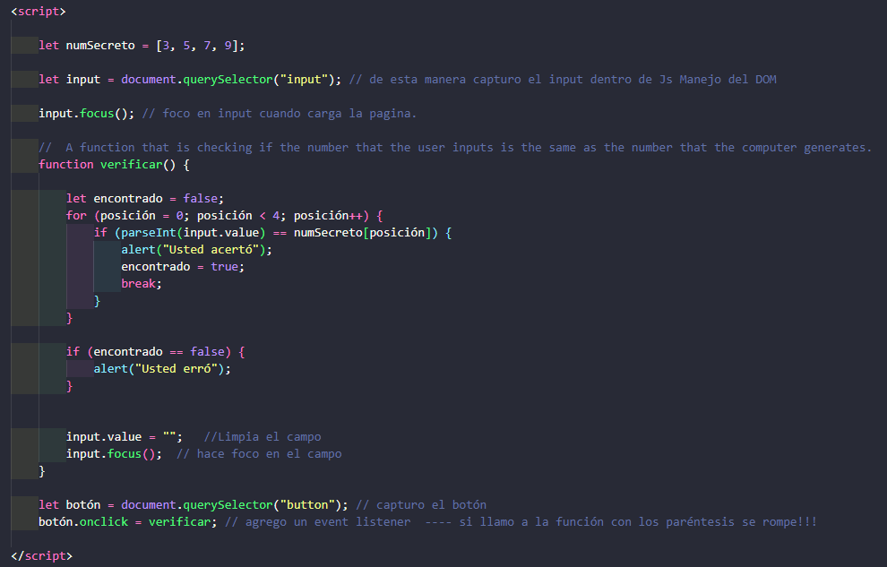

### Tamaño del Array

Solamente agrego el .length al array

### Lo que aprendimos

* Concepto y dinámica de los arrays.
* Usar iteraciones para cargar arrays.
* Descubrir el tamaño de los arrays.

## Clase 5
### Manipulando Array

Al juego de adivinar número con array le agrego 2 funciones para que genere arrays con números aleatorios.
Costó bastante.

### El ejercicio no fue tan difícil, pero me costó bastante entender la clase en donde filtra los duplicados, 5 - video 4.

### Lo que aprendimos

* Ingresar valores manualmente en los arrays con la función push.
* Resolver problemas más complejos usando varios conceptos de programación juntos en un mismo programa 
(_Loops, arrays, condiciones, funciones y fórmulas matemáticas_).

# Lógica de programación: Practicando con juegos y animaciones
## Canvas en html
https://www.w3schools.com/html/html5_canvas.asp

https://developer.mozilla.org/es/docs/Web/API/Canvas_API

Es una etiqueta contenedora para dibujar gráficos, pero los mismos deben ser dibujados en JavaScript.

Dentro de la etiqueta la comienzo a estilar.

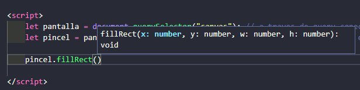

Para comenzar a dibujar usamos la función `.fillRect()` que admite 4 parámetros: `x`, `y`, `wide`, `height`.

`x` e `y` representan el inicio donde comienza nuestro dibujo, `W` y `H` donde termina.

Para seguir dibujando voy sobreescribiendo como en capas dentro del mismo canvas.

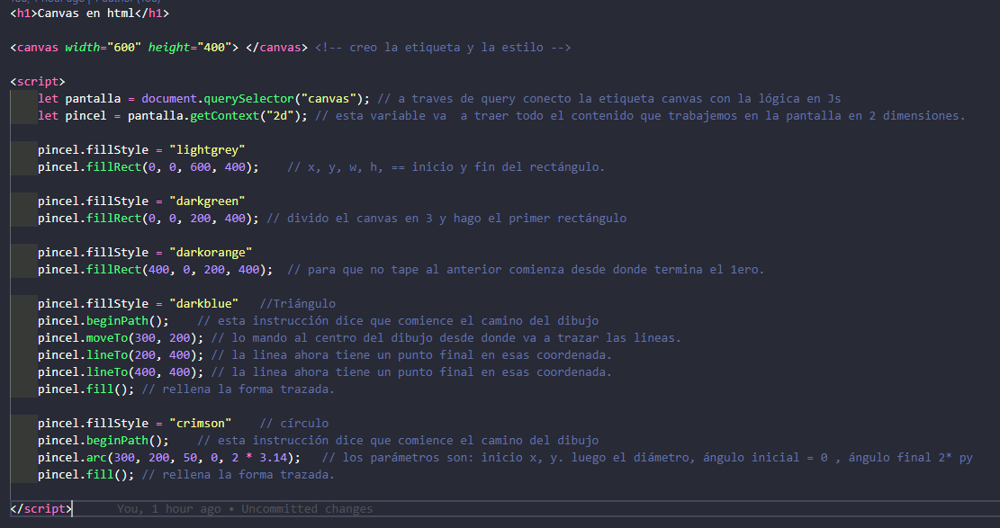

Más 2 soluciones en el código de la clase.
 
### Lo que aprendimos

* A usar el `Canvas` como una pizarra donde realizamos nuestros diseños.
* A diseñar figuras geométricas como rectángulos y circunferencias.
* A personalizar algunas propiedades de nuestras figuras como el color.

## Utilizando funciones clase 2
### Repetir código no es de buenos programadores

En esta clase crea una función para crear varios cuadrados y optimizar asi el código.

### Las iteraciones son fantásticas
Ahora creamos funciones con bucles para rellenar todo el canvas de cuadrados.

El while necesita una variable por fuera, 
Y para for hacemos la variable dentro de la condición

Ejemplo en el código.

### Diseñando una flor (Círculos)

Similar a la clase anterior ejemplos en el código creamos círculos y los posicionamos en el canvas.

### Gráfico de barras

Usé la solución del profesor VER LOS DETALLES Y EXPLICAR EL CÓDIGO. 

Un dia después lo vi y lo entendí hice comentarios en el código y sirve la explicación del profesor en el aula.

https://app.aluracursos.com/course/logica-de-programacion-juegos-animaciones/task/72842

## Clase 3 Interactuando con el usuario

### Nuestra pantalla tiene vida, responde sola

En esta clase veremos el lugar exacto donde el usuario hace clic

Con la función creada hago un console.log y en las herramientas de Dev busco la información capturada de cada evento.

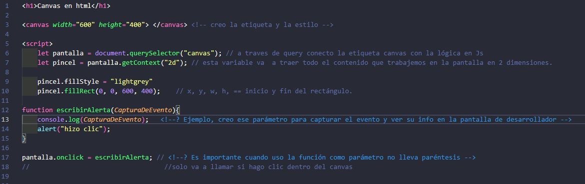

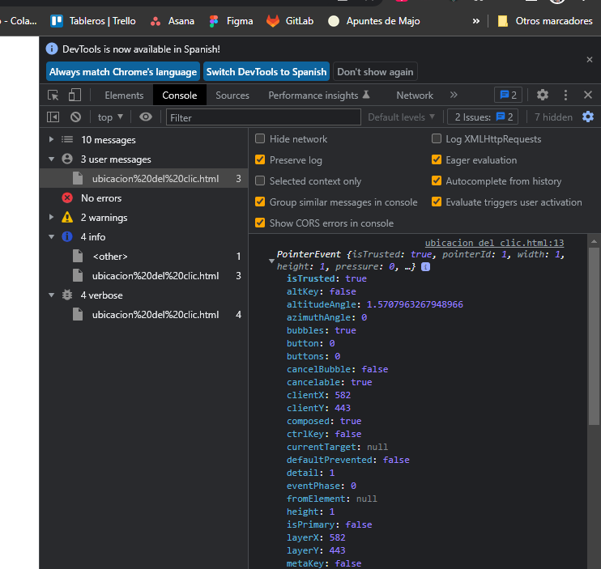

### Mouse, en cuál posición estás

Para esto en la función vamos a crear dos variables: la variable X, que va a ser nuestro `evento.pageX` o 
sea la posición en esta página, recordando que el evento es un parámetro pasado automáticamente por el navegador,
por el compilador, al momento que hacemos clic.

Aprovechando esta función creo una nueva para crear círculos en cada clic.

### Cambiando de color
https://app.aluracursos.com/course/logica-de-programacion-juegos-animaciones/task/72849

Este ejercicio lo intenté con un for para recorrer el array, pero la solución del profesor fue con un if para reiniciar 
el contador.

El ejercicio tiene comentarios está bien explicado

### Lo que aprendimos
* A interactuar con el usuario a través de los eventos.
* A asociar funciones con los eventos y a capturar las propiedades del evento para pasarlas como parámetro.

## Moviendo elementos con animaciones simples

### Ya diseñamos un círculo, ahora a darle vida

**Nuestro desafío en esta aula va a ser que nuestro programa sea interactivo, que él cree esas 
animaciones en forma automática, que pueda dibujar circunferencias, cuadrados, cualquier figura geométrica**

En esta clase agregamos dos funciones nuevas:
* limpiar pantalla con el método `.clearRect()` al que se le pasan los parámetros del canvas.
* Fijar intervalo con la función `setInterval(xxx, 100)` dentro va la función y el número representa el intervalo 
en milisegundos.

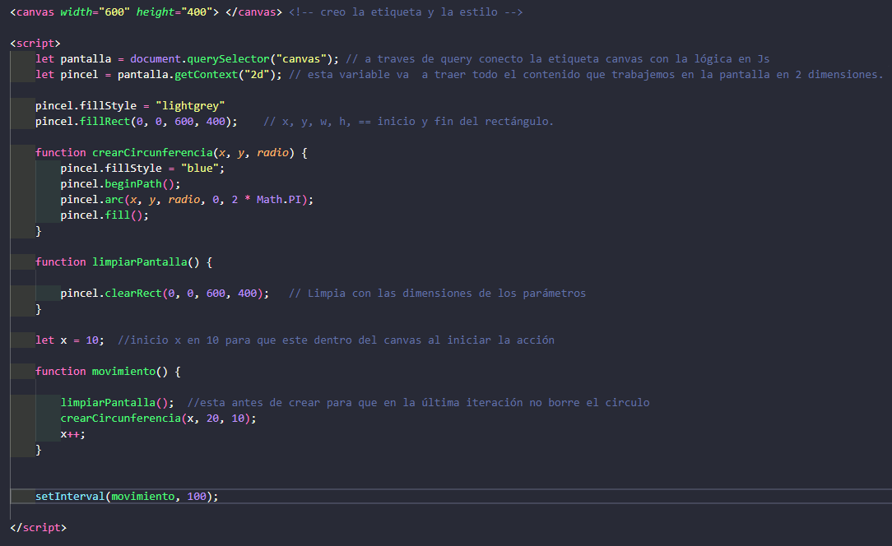

### Ejercicio

Hacer que ahora el círculo vaya y vuelva.
 
La circunferencia comienza de izquierda a derecha, pero cuando su posición `X` sea superior a 600, necesitamos invertir 
su sentido. La misma lógica cuando esté retornando de derecha para izquierda y la posición sea menor que 0, necesitamos 
invertir el sentido nuevamente.

Siendo así, vamos a crear una variable `sentido` vamos a inicializarla con el valor de 1, indicando que nuestra
variable `X` debe ser incrementada de 1 en 1, pero cuando sea mayor que 600, `sentido` recibirá el valor de -1, lo que hará 
el de decremento en la variable `X`. 

( Síntesis: si sumo 1 incrementa si sumo -1 resta asi continuamente hasta que cambia el valor de `sentido`)

Dentro de la función `actualizarPantalla`, antes de llamar a `disenharCircunferencia` vamos a verificar si necesitamos 
alterar el valor de `sentido`.

Ya que verificamos si `sentido` necesita ser alterado, ahora, después de llamar a la función `disenharCircunferencia`, 
vamos a usar el valor de nuestra variable para realizar el incremento de` X`.

#### El ejemplo está en la carpeta con el nombre de `círculo va y viene.html`

### Lo que aprendimos

* A realizar animaciones simples.
* A limpiar la pantalla usando `clearRect()`.
* A llamar a funciones a cada cierto intervalo de tiempo con `setInterval()`.

.