# Lógica de Programación: Primeros pasos

"CTRL + O" para abrir los archivos HTML, cuando sea necesario, y F12 o “CTRL + SHIFT + i” para abrir la ventana de 
herramientas del desarrollador (DevTools).

## Inicio

Su navegador es capaz de entender más de un lenguaje, por eso lo llamamos políglota.

Utilizan `Sublime text` para editar comenzaron con HTML básico. `<h1>` ` ` etc.

Mezcla en la primer clase Js dentro del HTML. Hizo un pop up sencillo: 

``

También se utilizó F12 para ver un error en Js 

Piensa que todo lo que está entre ``, está en el mundo JavaScript. Siendo así, el navegador 
interpretará ese trecho como JavaScript. Todo aquello que está escrito fuera de` `, es considerado
mundo HTML y será interpretado como HTML.

## Convenio de codificación

Es aconsejable siempre usar la codificación UTF8.

Con la instrucción `document.write(" texto ")` es útil para cosas dinámicas dentro del HTML que es estático. 
También mostró concatenación en Js

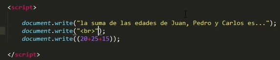

### Variables

Explicó variables en este caso para trabajar con fechas.

Utilizó `Math.round()`, También concatenó con otras variables string y num

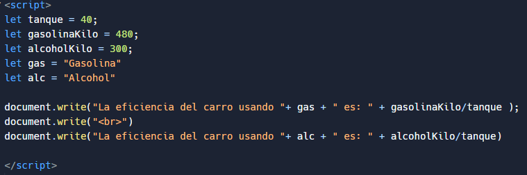

### Lo que aprendimos

* A usar variables para reducir código.
* Secuencia de la ejecución de nuestro código.
* Diferentes tipos de datos en las variables y fórmulas.
* Buenas prácticas de programación: Nomenclatura de variables.

## Cree sus propias funcionalidades

### Funciones

Creó una función sencilla para hacer saltos de línea.

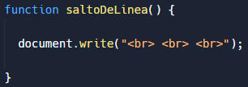 

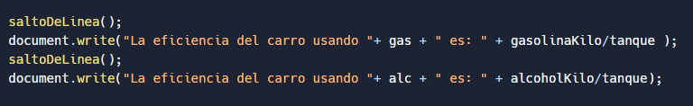

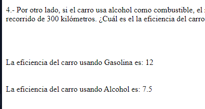

Juego crea otra función para ahorrar el `document.write()` mas bien a modo de ejemplo.

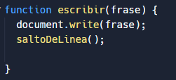 

En la misma func. agrego el texto que nombro frase y se lo paso como parámetro cada vez que la uso y dentro llamo a 
otra function la de saltar líneas.

* todo dentro de los paréntesis pasa a ser "frase" el argumento

### actividad 

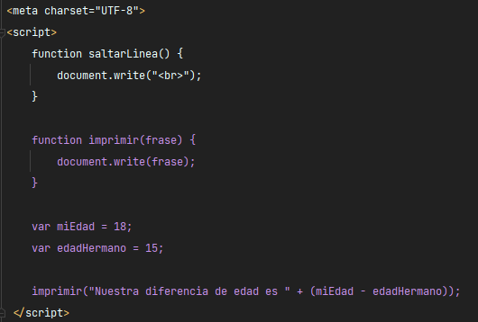

https://app.aluracursos.com/course/logica-de-programacion-primeros-pasos/task/72764

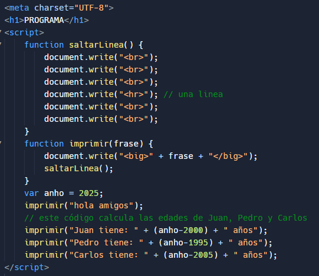

### Lo que aprendimos

* A crear funciones.
* Usar la consola de desarrollador para identificar errores y acompañar las variables.
* Buenas prácticas de programación: Nomenclatura de funciones.
* Funciones con parámetros.

### Normalmente, las funciones son creadas para retornar algo

Entonces la buena práctica aprendida es crear funciones objetivas que realicen en máximo una sola acción,
un solo cálculo y que nos retornen un valor y yo pueda reutilizar esa función en diferentes situaciones.

### Interactuando con el usuario

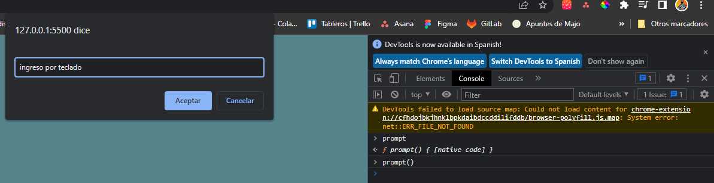

En este caso utilizo `f12` -- `console` -- el comando `prompt()`. para introducir valores por teclado y asi poder 
interactuar con el usuario.

La sintaxis completa y correcta es: `prompt(" pregunta ")` y eso lo asignamos a una variable.

Como en otros lenguajes, creé variables para almacenar las preguntas al usuario, y en este caso una variable más para
almacenar el retorno de la función. 

_Siempre va a devolver una string entonces si se multiplica lo usa como número si es suma lo concatena_

## Lógica de programación: Conceptos primordiales 2.º curso.

### Ejecute códigos diferentes dependiendo de la condición

**La función `prompt()` Siempre va a devolver una string entonces si se multiplica lo usa como número si es suma lo concatena**

Para solucionar esto usamos `parseInt`

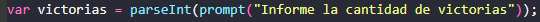

### Trabajando con condiciones

En esta clase crea comparaciones con `if` las cuales devuelven un booleano y son utilizadas para comparar valores.

Lo explicó de forma secuencial y lógica de las 3 condiciones solo una podía cumplirse a la vez y fueron 3 `if` 
diferentes a modo de explicación.

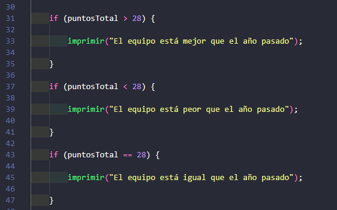

### Mejorando el programa de IMC

Basado en la clase anterior y la tabla de la OMS se agrega el resultado para el usuario.

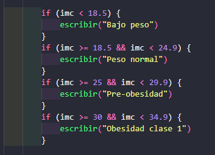

### Juego de adivinación de número

En esta clase utilizamos `Math.random()` para generar un valor aleatorio, a este número lo redondeo con `Math.round()`.
También se comenzó a usar el `else`.

https://www.w3schools.com/js/js_random.asp tiene bastantes reglas, siempre da un num entre 0 y menor a 1 por eso
lo multiplica por 10, y lo redondean porque es decimal.

.